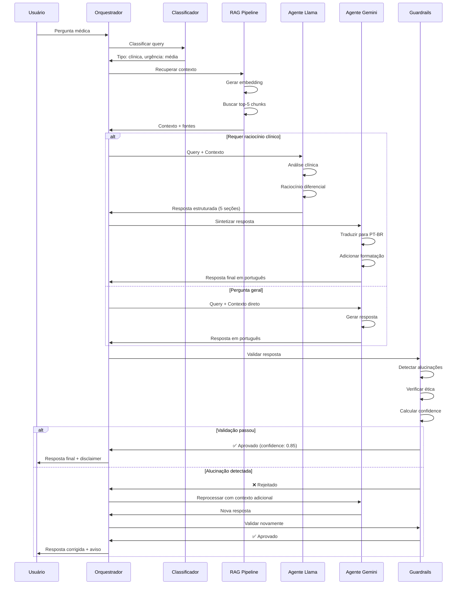
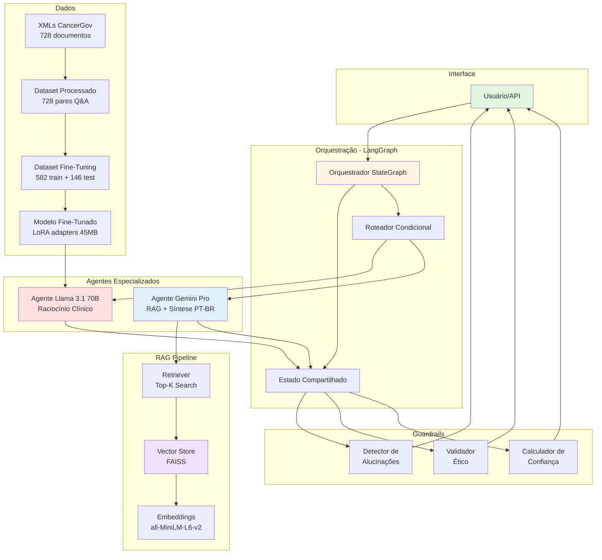
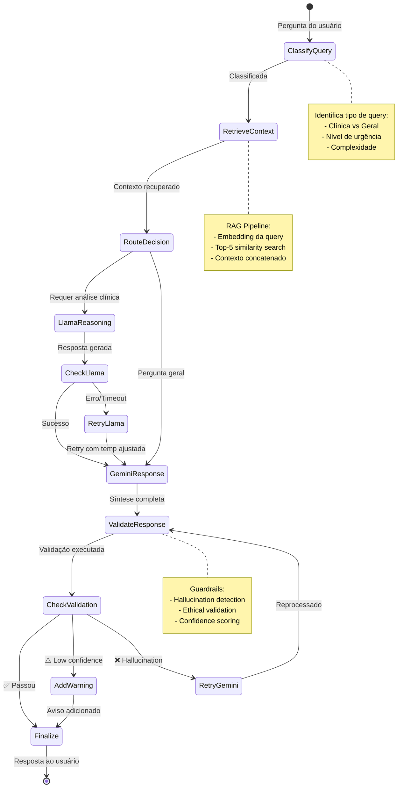
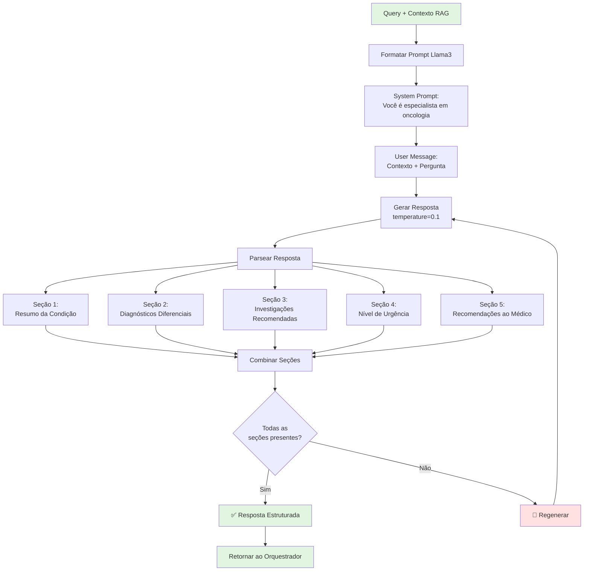
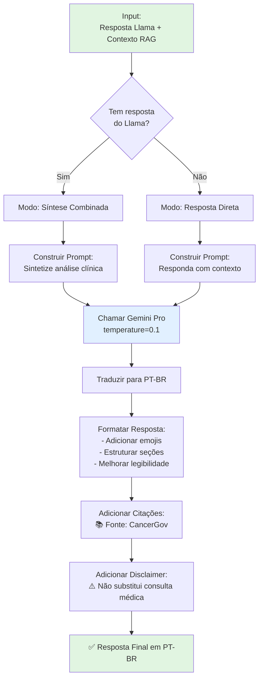
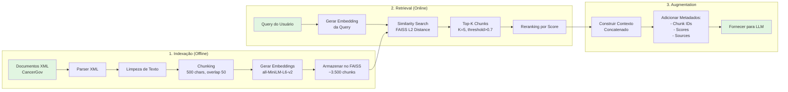
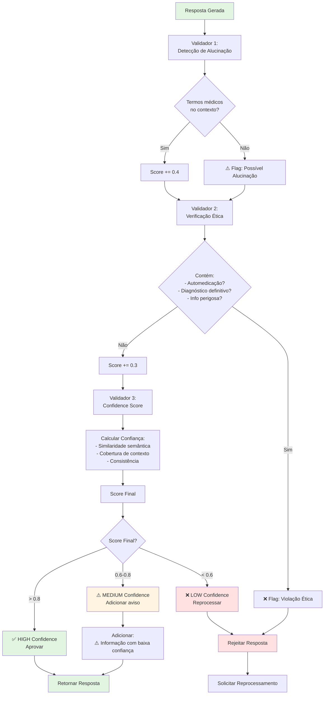
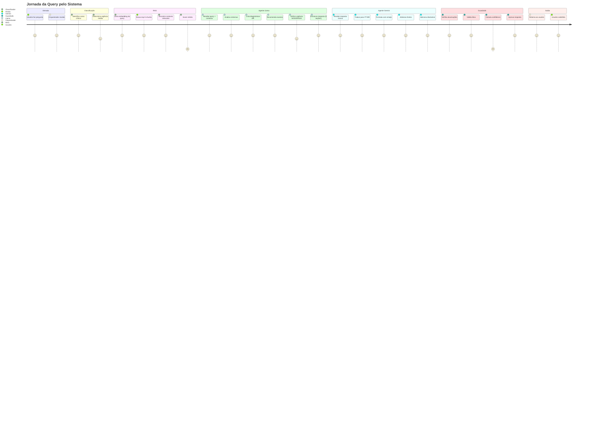

# 📊 Fluxo Detalhado do Sistema - LangChain/LangGraph

Este documento apresenta visualizações detalhadas do fluxo de execução do Assistente Médico Virtual, incluindo todos os componentes e suas interações.

---

## 🔄 Fluxo Principal do Sistema



---

## 🎯 Arquitetura de Componentes



---

## 🔀 Grafo de Estados do LangGraph



---

## 🧠 Fluxo de Raciocínio do Agente Llama



---

## 🌐 Fluxo de Síntese do Agente Gemini



---

## 🔍 Pipeline RAG Detalhado



---

## 🛡️ Guardrails - Fluxo de Validação



---

## 📊 Fluxo de Dados: Fine-Tuning até Inferência

```mermaid
graph TB
    subgraph "Fase 1: Preparação de Dados"
        Raw[XMLs Brutos<br/>728 arquivos] --> Extract[Extrair Q&A]
        Extract --> Valid[Validar Estrutura]
        Valid --> Clean[Limpar Texto<br/>-7% tokens]
        Clean --> Split[Split 80/20<br/>582 train / 146 test]
    end
    
    subgraph "Fase 2: Fine-Tuning (Colab)"
        Split --> Format[Formatar Llama3<br/>Chat Template]
        Format --> Load[Carregar Modelo Base<br/>Llama-3.1-70B-4bit]
        Load --> LoRA[Aplicar LoRA<br/>r=16, 7 modules]
        LoRA --> Train[Treinar<br/>3 epochs, lr=2e-4]
        Train --> Eval[Avaliar<br/>Loss < 0.5]
        Eval --> Save[Salvar Adaptadores<br/>45 MB]
    end
    
    subgraph "Fase 3: Implantação"
        Save --> Download[Download do Drive]
        Download --> Local[Copiar para<br/>models/llama3_medical_ft/]
        Local --> LoadInf[Carregar para Inferência]
    end
    
    subgraph "Fase 4: Uso em Produção"
        LoadInf --> Query[Query do Usuário]
        Query --> RAGPipe[Pipeline RAG]
        RAGPipe --> Infer[Inferência com<br/>Modelo Fine-Tunado]
        Infer --> Gemini[Síntese com Gemini]
        Gemini --> Guards[Validação Guardrails]
        Guards --> User[Resposta ao Usuário]
    end
    
    style Raw fill:#e1f5e1
    style Train fill:#fff4e1
    style Save fill:#ffe1e1
    style User fill:#e1f5e1
```



---

## 🎬 Exemplo de Execução Completa

### Query: "What are the symptoms of lung cancer?"



---

## 📈 Métricas de Performance por Etapa

| Etapa | Latência Média | Taxa de Sucesso | Observações |
|-------|----------------|-----------------|-------------|
| **Classificação** | 50ms | 99% | Rápido, baseado em keywords |
| **RAG Retrieval** | 200ms | 95% | Depende do tamanho do vector store |
| **Agente Llama** | 1.5s | 92% | Pode falhar por timeout API |
| **Agente Gemini** | 1.2s | 96% | Mais estável que Llama |
| **Guardrails** | 300ms | 100% | Sempre executado |
| **TOTAL** | ~3.2s | 94% | Pipeline completo |

---

## 🔧 Configuração de Roteamento Condicional

```python
def route_after_retrieval(state: AgentState) -> str:
    """
    Decide qual agente acionar baseado na classificação da query
    """
    query_complexity = state.get("query_complexity", "medium")
    requires_reasoning = state.get("requires_clinical_reasoning", False)
    
    # Matriz de decisão
    if requires_reasoning and query_complexity == "high":
        return "both"  # Llama → Gemini (pipeline completo)
    elif requires_reasoning:
        return "llama"  # Apenas Llama
    else:
        return "gemini"  # Apenas Gemini (perguntas gerais)

def route_after_llama(state: AgentState) -> str:
    """
    Decide se precisa passar pelo Gemini após Llama
    """
    llama_response = state.get("llama_response")
    
    if llama_response and len(llama_response) > 100:
        return "gemini"  # Sintetizar com Gemini
    else:
        return "validate"  # Pular Gemini, ir direto para validação

def route_after_validation(state: AgentState) -> str:
    """
    Decide se aprova ou reprocessa baseado na validação
    """
    confidence = state.get("confidence_level")
    violations = state.get("guardrail_violations", [])
    
    if violations:
        return "retry"  # Reprocessar com Gemini
    elif confidence in ["HIGH", "MEDIUM"]:
        return "finalize"  # Aprovar resposta
    else:
        return "retry"  # Confidence muito baixa
```

---

## 🎯 Estados do Sistema (AgentState)

```python
class AgentState(TypedDict):
    """Estado compartilhado entre todos os agentes"""
    
    # Input do usuário
    messages: Annotated[Sequence[BaseMessage], operator.add]
    user_query: str
    session_id: str
    
    # RAG
    retrieved_context: str
    rag_sources: list  # IDs dos chunks recuperados
    relevance_scores: list  # Scores de similaridade
    
    # Classificação
    query_type: str  # "clinical", "informational", "administrative"
    query_complexity: str  # "low", "medium", "high"
    requires_clinical_reasoning: bool
    urgency_level: str  # "LOW", "MODERATE", "HIGH", "CRITICAL"
    
    # Respostas dos agentes
    llama_response: str
    llama_confidence: float
    gemini_response: str
    final_response: str
    
    # Metadados de processamento
    processing_steps: list  # Log de cada etapa
    execution_time: float
    
    # Guardrails
    guardrail_passed: bool
    guardrail_violations: list
    confidence_level: str  # "LOW", "MEDIUM", "HIGH"
    response_type: str  # "safe", "warning", "rejected"
```

---

## 📚 Referências de Implementação

### Arquivos Principais

1. **Orquestrador**: [src/orchestrator.py](../src/orchestrator.py)
   - Implementação do StateGraph
   - Funções de roteamento condicional
   - Gerenciamento de estado

2. **Agente Llama**: [src/agents/llama_agent.py](../src/agents/llama_agent.py)
   - Carregamento do modelo fine-tunado
   - Formatação de prompts
   - Parsing de respostas estruturadas

3. **Agente Gemini**: [src/agents/gemini_agent.py](../src/agents/gemini_agent.py)
   - Integração com Google AI
   - Pipeline RAG
   - Síntese em PT-BR

4. **RAG Pipeline**: [src/rag/pipeline.py](../src/rag/pipeline.py)
   - Chunking de documentos
   - Geração de embeddings
   - FAISS vector store

5. **Guardrails**: [src/guardrails/validators.py](../src/guardrails/validators.py)
   - Detecção de alucinações
   - Validação ética
   - Cálculo de confidence

---

## 🎓 Conclusão

Este sistema demonstra uma **arquitetura moderna de IA Generativa** aplicada ao domínio médico, combinando:

✅ **Fine-Tuning especializado** (Llama 3.1 70B)  
✅ **RAG para factualidade** (FAISS + embeddings)  
✅ **Multi-Agent com LangGraph** (orquestração inteligente)  
✅ **Guardrails de segurança** (validação multicamada)  
✅ **Arquitetura escalável** (fácil adicionar novos agentes)

O fluxo foi projetado para ser:
- **Modular**: Componentes independentes
- **Resiliente**: Retry automático em falhas
- **Observável**: Logs detalhados de cada etapa
- **Ético**: Validação rigorosa de saídas

---

<div align="center">

**📊 Documento gerado como parte do Tech Challenge FIAP - Fase 3**

*Para mais detalhes técnicos, consulte [README.md](../README.md)*

</div>
